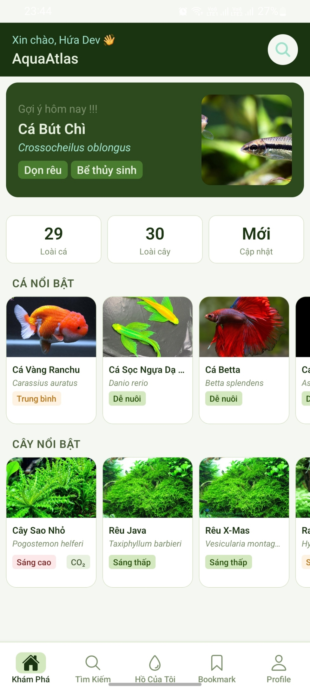
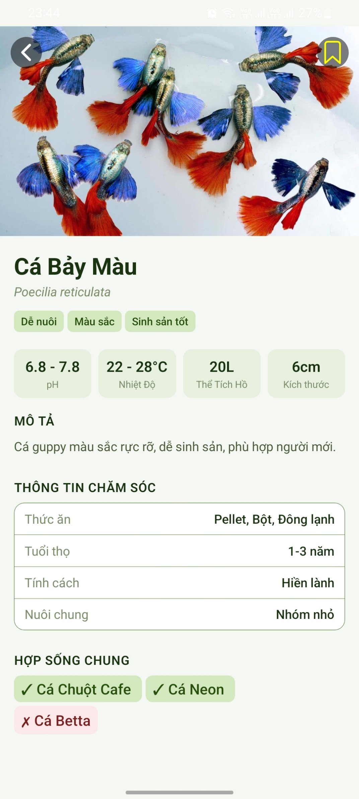
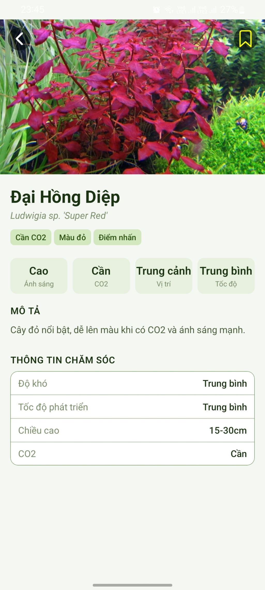
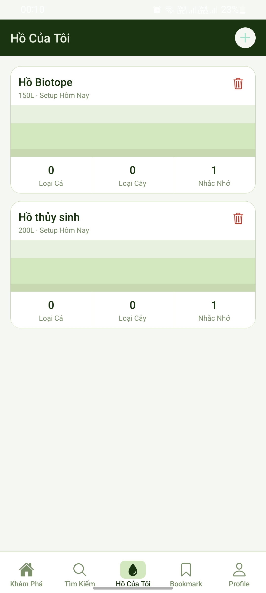
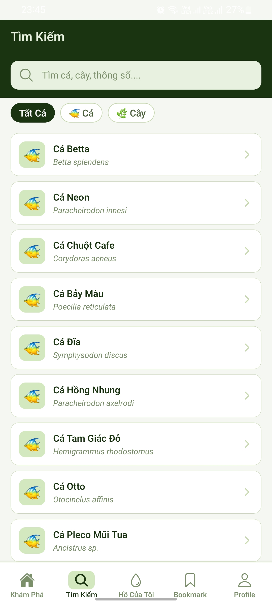

# AquaAtlas

Ứng dụng di động tra cứu thủy sinh (cá, cây, bể) xây dựng bằng Expo + React Native.  
A mobile aquarium reference app (fish, plants, tanks) built with Expo + React Native.

## 1) Giới thiệu | Overview

**VI**

- AquaAtlas giúp người dùng tra cứu thông tin cá và cây thủy sinh, lưu mục yêu thích và quản lý bể cá cá nhân.
- Dự án dùng kiến trúc tách lớp theo `app` (routing), `components` (UI), `store` (state), `services` (API), `data` (static JSON).

**EN**

- AquaAtlas helps users browse fish and aquatic plants, save bookmarks, and manage personal tanks.
- The codebase follows a layered structure with `app` (routing), `components` (UI), `store` (state), `services` (API), and `data` (static JSON).
## Tải ứng dụng | Download App

**VI**
- **Android (Bản thử nghiệm APK):** [Tải file APK trực tiếp tại đây](https://github.com/HuaNgocThien/AquaAtlas/releases/download/v1.0.0/application-58230247-2c9c-4495-8549-f452cfb44225.apk)
- *Lưu ý:* Do đây là file APK cài trực tiếp không thông qua Google Play, điện thoại của bạn có thể cảnh báo "Cài đặt từ nguồn không xác định", bạn chỉ cần chọn "Vẫn cài đặt" (Install anyway) là được.

**EN**
- **Android (Preview APK):** [Download APK directly here](https://github.com/HuaNgocThien/AquaAtlas/releases/download/v1.0.0/application-58230247-2c9c-4495-8549-f452cfb44225.apk)
- *Note:* Since this is a direct APK installation outside of Google Play, your device might show an "Unknown Sources" warning. Simply tap "Install anyway" to proceed.

## Ảnh chụp app | Screenshots.






## Video Demo
- Link video: https://youtube.com/shorts/jDS7ZdB3LzA

## 2) Công nghệ chính | Tech Stack

- Expo SDK 55
- React 19 + React Native 0.83
- TypeScript
- Expo Router
- Zustand (state management)
- AsyncStorage / MMKV (local persistence)
- Jest + Testing Library React Native
- EAS Build

## 3) Cấu trúc thư mục | Project Structure

```text
aquaatlas/
├─ app/                    # Route/screens (expo-router)
│  ├─ (tabs)/              # Main tab screens
│  ├─ auth/                # Login/Register
│  ├─ fish/[id].tsx        # Fish detail
│  ├─ plant/[id].tsx       # Plant detail
│  └─ tank/[id].tsx        # Tank detail
├─ components/             # Reusable UI components
├─ constants/              # Theme and constants
├─ data/                   # Static fish/plant JSON data
├─ hooks/                  # Custom hooks
├─ services/               # External services (Firebase auth)
├─ store/                  # Zustand stores
├─ types/                  # Shared TypeScript types
├─ utils/                  # Helper functions
├─ app.json                # Expo app config
├─ eas.json                # EAS build profiles
└─ package.json
```

## 4) Yêu cầu môi trường | Requirements

**VI**

- Node.js LTS (khuyến nghị >= 18)
- npm
- Expo CLI (thông qua `npx expo ...`)
- Android Studio / Xcode (nếu chạy giả lập native)

**EN**

- Node.js LTS (recommended >= 18)
- npm
- Expo CLI (via `npx expo ...`)
- Android Studio / Xcode (for native simulators/emulators)

## 5) Cài đặt và chạy dự án | Setup and Run

```bash
npm install
```

Tạo file `.env` từ `.env.example` và điền API key Firebase:

Create `.env` from `.env.example` and provide your Firebase API key:

```env
EXPO_PUBLIC_FIREBASE_API_KEY=your_firebase_web_api_key
```

Chạy ứng dụng | Run the app:

```bash
npm run start
npm run android
npm run ios
npm run web
```

## 6) Build với EAS | EAS Build

**VI**

- `eas.json` có 2 profile:
  - `preview`: build APK nội bộ (`distribution: internal`)
  - `production`: build Android App Bundle (`.aab`)

**EN**

- `eas.json` includes 2 profiles:
  - `preview`: internal APK build
  - `production`: Android App Bundle (`.aab`) build

Ví dụ | Example:

```bash
eas build --platform android --profile preview
```

## 7) Kiểm thử | Testing

**VI**

- Dự án đã có test cho `store`, `services`, và `utils`.
- Chạy test bằng:

**EN**

- The project already includes tests for `store`, `services`, and `utils`.
- Run tests with:

```bash
npx jest
```

## 8) Biến môi trường | Environment Variables

| Variable                       | Required | Description                               |
| ------------------------------ | -------- | ----------------------------------------- |
| `EXPO_PUBLIC_FIREBASE_API_KEY` | Yes      | Firebase Web API key used by auth service |

## 9) Ghi chú bảo mật | Security Notes

**VI**

- Không commit `.env` thật lên repository.
- Chỉ dùng key public phù hợp cho client app và cấu hình Firebase Rules đúng cách.

**EN**

- Do not commit real `.env` values.
- Use only client-safe public keys and configure Firebase rules properly.

## 10) Giấy phép | License

Hiện chưa khai báo license trong repository.  
No explicit license is currently declared in this repository.
